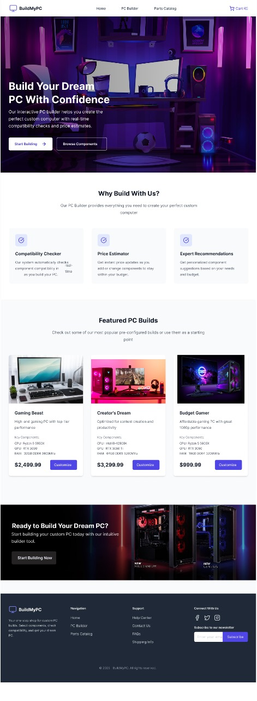

# 🛠️ PC Builder – Project Management Report
## 🖼️ UI Preview

## 📘 Overview
This repository contains the full project management documentation for **PC Builder**, a dual-platform e-commerce application that allows users to configure and purchase custom-built PCs. The project follows Agile methodologies and focuses on delivering a high-quality, user-centered experience.

## 🚀 Project Summary
**PC Builder** is designed to:
- Provide a catalog of PC hardware components
- Offer real-time compatibility checks during the build process
- Allow users to save builds and manage accounts
- Include pricing estimation for builds with optional services
- Deliver a Minimum Viable Product (MVP) first, followed by iterative updates

## 📁 Project Deliverables
- **Project Charter** – Outlines objectives, scope, stakeholders, milestones, and budget  
- **Solution Architecture** – Defines the system structure, behavior, and component interactions  
- **Release Plan** – Sprint structure, features breakdown, and priorities  
- **Kanban Chart** – Visual task management system  
- **Project Plan** – Timeline and high-level tasks (via Excel)  
- **Preliminary Budget** – Estimated labor and operational costs with risk considerations  
- **Conclusion** – Project summary and next steps  
- **Appendices** – Supporting data and documents  

## 🧑‍💻 Tools & Technologies
- Agile & Kanban methodology  
- Microsoft Excel (for planning and budgeting)  
- Figma (UI/UX design references)  
- Jira (task and sprint tracking)  
- Node.js, React.js, Flutter, MySQL (based on proposed architecture)

## 🎯 Key Outcomes
- End-to-end project plan aligned with software project management best practices  
- Effective resource estimation and cost planning  
- Iterative release approach with MVP and user feedback cycles  
- Emphasis on risk mitigation, stakeholder communication, and quality assurance  

## 📌 Success Metrics
- Page load time ≤ 3 seconds  
- Compatibility validation accuracy ≥ 99%  
- Targeted user satisfaction ≥ 85%  
- Platform uptime ≥ 95%  

